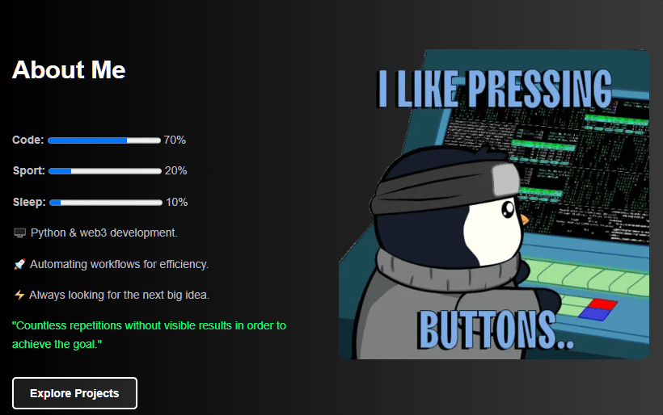

## Skills & Tools:

 

## 🚀 Projects

| Project                                                                                      | Description                                            |
|----------------------------------------------------------------------------------------------|--------------------------------------------------------|
| [eth-pretty-address](https://github.com/thankyoucrypto/eth-pretty-address)                   | Create nice Ethereum wallet addresses.                 |
| [solana-pretty-address](https://github.com/thankyoucrypto/solana-nice-wallet-address-generator) | Create nice Solana wallet addresses.                   |
| [proxy-checker-all-types](https://github.com/ThankYouCrypto/project2)                       | Check proxies across all types for enhanced security.  |
| [seed-to-private-key-address-all-chains](https://github.com/thankyoucrypto/seed-to-private-key-address-all-chains) | Generate private keys from seed phrases across chains. |
| [big-files-reader](https://github.com/thankyoucrypto/big-files-reader)                       | Efficiently read and process large files in Python.    |
| [TEA Testnet on Selenium](https://github.com/thankyoucrypto/tea-testnet-v2)                 | Automate TEA testnet for airdrop rewards.              |

 

    <h1>Stats:</h1>
    
    

 

## 🌐 Join my Socials

### [📢 --> Alpha TG-channel](https://t.me/yolo_gems)
### [💬 --> Alpha TG-chat](https://t.me/yolo_gems_chat)
### [👤 --> Personal TG](https://t.me/UsernameX777)

 

